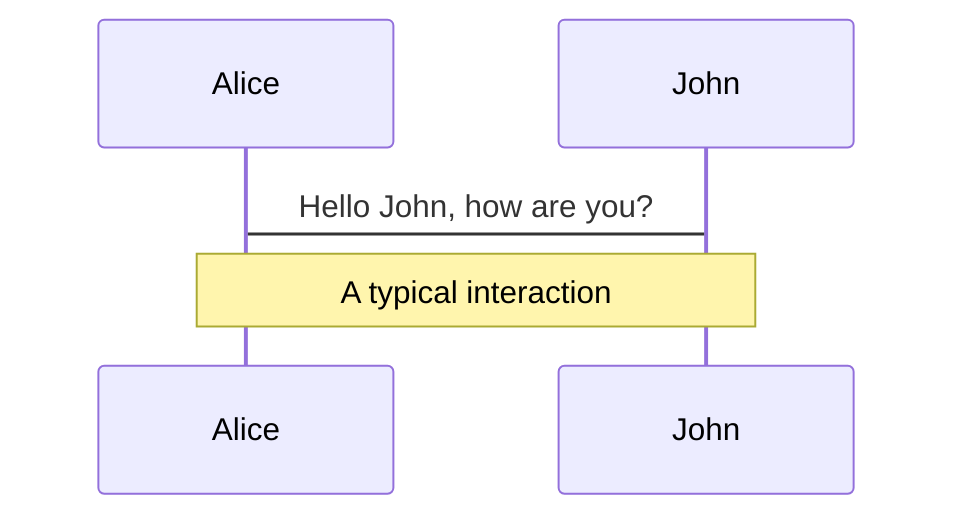
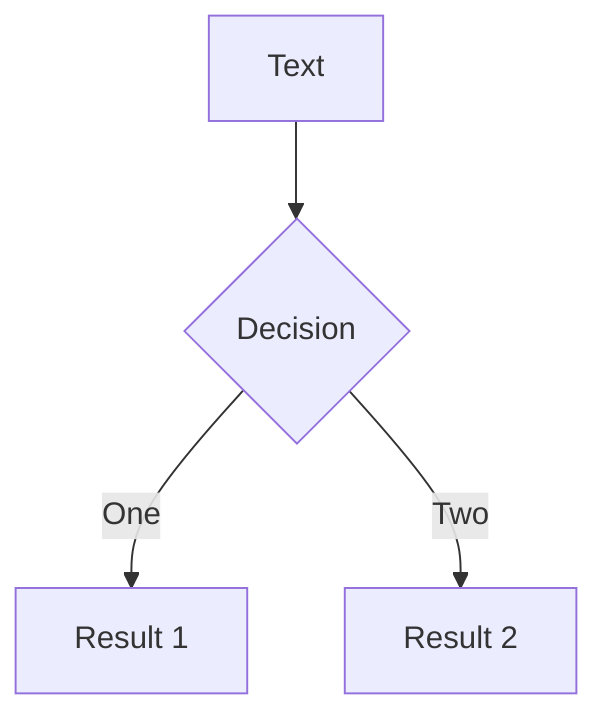
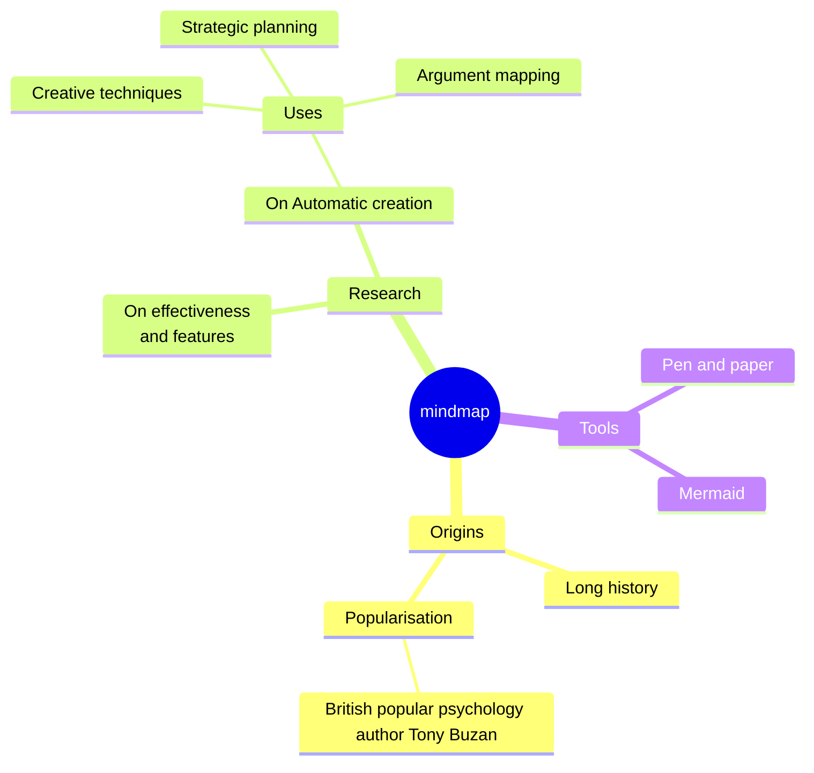
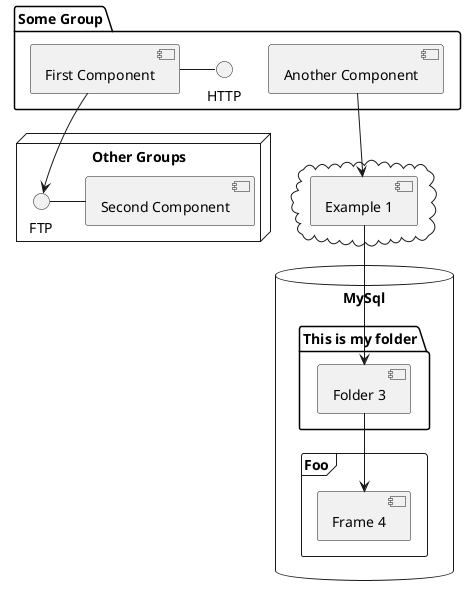

---
# You can also start simply with 'default'
theme: default
# random image from a curated Unsplash collection by Anthony
# like them? see https://unsplash.com/collections/94734566/slidev
background: vroom.jpg
# some information about your slides (markdown enabled)
title: Testing our way to a better developer experience
info: |
  ## Slidev Starter Template
  Presentation slides for developers.

  Learn more at [Sli.dev](https://sli.dev)
# apply unocss classes to the current slide
class: text-center
# https://sli.dev/features/drawing
drawings:
  persist: false
# slide transition: https://sli.dev/guide/animations.html#slide-transitions
transition: slide-left
# enable MDC Syntax: https://sli.dev/features/mdc
mdc: true
# take snapshot for each slide in the overview
overviewSnapshots: true
fonts:
  sans: Monaspace Argon
  serif: Monaspace Xenon
  mono: Monaspace Neon
---

# Testing our way to a better <br> developer experience

## Will Klein


<style>
.slidev-layout.cover h1 {
  position: absolute;
  top: 10px;
  right: 10px;
  text-align: right;
  font-size: 50px;
}

h2 {
  color: white;
  position: absolute;
  top: 200px;
  right: 10px;
  text-align: right;
}
</style>

<div class="abs-br m-6 flex gap-2">
  <button @click="$slidev.nav.openInEditor()" title="Open in Editor" class="text-xl slidev-icon-btn opacity-50 !border-none !hover:text-white">
    <carbon:edit />
  </button>
  <a href="https://github.com/willklein/testing-dx" target="_blank" alt="GitHub" title="Open in GitHub"
    class="text-xl slidev-icon-btn opacity-50 !border-none !hover:text-white">
    <carbon-logo-github />
  </a>
</div>


<!--

My name is Will Klein, and I'd like to share with you how we can test our way to a better developer experience.

I started Toolspace, a consultancy focused on building great dev tools
and improving the developer experience for everyone.

Testing is one of my favorite tools and when used correctly, it can help us enjoy writing code even more.

I'd like to share with you how we can do that.

-->

---
layout: image
image: patch.jpg
---

<!--
but first, i ahve a quick story to share

i have a client project where i shipped a big UI feature recently. it was challenging to implement

partly because i was new to the codebase, but also because I felt like the developer experience was lacking

in particular, there were unit tests, but nothing for integration tests or end to end tests.

it was hard to know when i made a change, what it would impact.

and when i shipped my first feature, everything seemed ok, but then a week later, i heard from the client

that my work broke something critical

i actually squinted and thought, i was really careful, maybe too careful, but i couldn't rule this out.

so i stopped what i was doing to investigate. honestly, i wished it was something i did, because fixing that would have been

within my control. somewhat unfortunately, i verified it wasn't my change - which meant the rest of the team had to investigate it
-->

---
layout: image
image: puzzle.jpg
---

<!--
this is not where anyone wants to be.

It's one thing to have a test failure that you don't understand.

It's much worse when you don't have any test failures, and something is broken, that you don't understand.

we don't know when the problem was introduced, and instead, we could have maybe caught it immediately if we had some good tests in place
-->

---
font: serif
---

<AutoFitText :max="200" :min="100" modelValue="When do we write tests?"/>

<!--

this brings me to my first lesson (slide)

we were missing some tests, and we could write them now, but when should we have written them?

-->

---

# TDD is great when we know...

- what things we need to write
- where they should go

<br>
<br>
<br>
<br>

# It helps to have:
- well-established patterns & frameworks that rarely change

<!--

So we were missing some tests, and we could write them now, but when should we have written them?

-->
---

<AutoFitText :max="200" :min="100" modelValue="NOT frontend in 2024"/>

<!--

That is NOT frontend in 2024!

I think we have the most competitive landscape yet in terms of frameworks. If you work on more than one project, it's more likely than ever to have major differences.

I think this is great, but not for TDD.

-->
---

> The feature work is done<br>...<br>I just need to write the tests.

<cite>- Someone at standup</cite>

<style>
*, blockquote p {
  font-size: 50px;
  line-height: 80px;
}
</style>

<!--
Testing last isn't great either.

Who has heard someone say this:
...

I've said it.

Now we writing tests is a chore though.
-->
---

<AutoFitText :max="200" :min="100" modelValue="Write tests as soon as you can"/>

<!--
I'll call this pseudo-TDD.

I rarely write all my tests first.

I prefer to start feature development, or start fixing a bug, and I continue until I have a much better idea of what I'm doing. Usually, I have thing working, at least.
-->

---
layout: image
image: sketch.jpg
---

<!--
This is a critical moment in my development workflow.

I understand most of what I need to do. I still have more code to write, and I want to set myself up for success.

I want to create a feedback loop where as things are working, I don't break them unintentionally.

Maybe also, I don't want to manually test the UI over and over again. I want to automate filling out a form and navigating to another page.

This is the single most wonderful way to use tests. You write them once you know what you need to do, and then as you go, they tell you if you are on the right track. You use them as a feedback loop.
-->

---
layout: image
image: trap.avif
---

<!--

The next challenge I'd like to discuss is how we know what to test.

There's one particular trap that I've encountered, and that's where a popular testing tool can lead us astray.

Code coverage.

The most useless tests I've written, or seen others write, were written to increase code coverage.
-->
---

<AutoFitText :max="200" :min="60" modelValue="a metric for measuring how much of your code is executed by your tests"/>

<!--

That sounds great!

But I like to compare it to measuring developer productivity by lines of code written.

-->
---

# &nbsp;
# &nbsp;

# `Lines of Code !== Quality of Code`

# &nbsp;

# `High Code Coverage !== Quality of Tests`

<style>
  h1 {
    text-align: center;
    font-size: 32px;
  }
</style>

<!--
I still think code coverage is nice to have, kind of like when I look at a PR, and I can see how many files are touched, and how many lines are added or deleted. Knowing where code coverage is at, is useful.

But it's just a metric, and like any good metric, they can be gamed.

In testing, it often incentivizes writing a test, but not writing a good test.

It distracts us from where we should really be focusing.

-->
---
layout: image
image: users.jpg
---

<!--
Remember our users?

This is really about them. Well I want to make the case it's not all about them, but let's think about what they care about.

If we're building UI, it's usually something to help someone complete a task. To do their job. To get paid.

Our tool better make sure it is doing that, and if we are going to test something, make sure we focus on the impact to the user.

Instead of code coverage, let's think in terms of user experience coverage.

Prioritize what matters most to our users and test that really well.

Then if something is expensive to test, we have to justify that expense.

Maybe we don't worry too much about the avatar editor, and how well someone can crop their picture.

We care more that they can login and update their email address when they need to.

-->
---

<!--


So we talked about what to focus on when writing our tests, on testing the right things.

We also discussed earlier when to write our tests, and how they should create a useful feedback loop.

Let's talk a more about that. Here's three more ways we can increase our DX with testing.
-->
---

# Tests as Documentation

```ts {all|1} twoslash
it('returns a string that is the sum of all the row values', () => {
  // ...
})
```

versus

```ts {all|1} twoslash
it('shows the shopping cart total', () => {
  // ...
})
```

<!--
There can be some subtlety in how we communicate what our code is doing.

The most common mistake to avoid is where the test is describing implementation details. This is easy to do, but adds no value.

Better is to describe the impact to the user. Document the user features this code implements, that you are testing.

Imagine creating a document out of all your tests - it should describe what your app provides to the user.
-->

---

> The more your tests resemble the way your software is used, the more confidence they can give you.

<cite>- Guiding Principle, Testing Library</cite>

<!--
The test utilities and documentation for Testing library are so good, I have to call them out. Other libraries do this too, but this one in particular is often useful with a variety of tools and frameworks, so I'm going to focus on it for a moment.

Using accessible selectors is really valuable for two reasons:

1) your tests will be more accurate

-->

---

HTML output:
```html
<p data-testid="custom-element">Something important to the user</p>
```

Tests:
```ts {3,5} twoslash
import {screen} from '@testing-library/dom'

const element = screen.getByTestId('custom-element')

expect(element.textContent).toBe('Something important to the user')

```

<!--
Here's a quick example. Maybe we use a test id to lookup an element in the DOM, and maybe we are asserting that it's displaying something important to the user.

This seems ok, but what if there is some styling that hides the element from being visible?

Our test will still pass, but we might have a major bug.

-->

---

HTML output:
```html
<p>Something important to the user</p>
```

Tests:
```ts {3,5} twoslash
import {screen} from '@testing-library/dom'

const element = screen.getByText('Something important')

// we already know the text value was visible
```

<!--
Instead we can use accessible selectors to look up elements and text on the page more closely to how a real user would find it. This is especially important for making sure things work with screen readers, especially when dealing with roles.

So our tests will both be more valuable to us because they will catch more problems, but we're also going to protect the user experience as well.

-->

---
layout: image
image: linters.jpg
---

<!--

I also need to mention one of my favorite tools: linters.

Linters like ESLint help us test our conventions.

It's not just about code conventions though. There are rules and plugins that can prevent bugs, and protect the user experience.

Most importantly, they give us feedback in real time. As we implement something that doesn't adhere to best practices, like say we have an image that's missing alt text in our HTML template or JSX, our linter can tell us right away.

This form of testing is nearly automatic. We can don't have to test lots of individual things, we just need to configure the rule or plugin to handle it.
-->

---

# Lean into custom matchers

```ts
expect.extend({

  // usage: expect(value).toBeFoo()
  toBeFoo(received, expected) {
    const { isNot } = this

    return {
      // we define a pass condition
      pass: received === 'foo',

      // if that is falsy, this custom message will render
      message: () => `${received} is${isNot ? ' not' : ''} foo`
    }
  }
})
```

<!--
I adapted this quick example from the Vitest docs. This is a very simple example, just asserting that the value is the string value 'foo'.

But imagine a more complex assertion, like iterating over a collection of values and making sure they have the right values?

If that fails, the output is unlikely to be helpful with basic assertions.

But we can write custom matchers that have richer logic, and design their failure messages to be helpful.

I always try to look at my failing tests - always failing them once of course - and ask myself: does this failure make sense? can it be more helpful?

sometimes that means writing a custom matcher, and sometimes it's even easier, just using better assertions for the situation
-->


---
layout: image
image: wood-tools.jpg
---

<!--
I only covered a small handful of ways our tests can improve our developer experience. If you ever find testing to be a chore, or not providing value to you as a developer. Stop and reflect, there's likely changes you need to make that will turn this around.

Remember why we write tests. It isn't just about preventing defects. It's a developer tool. It can help us understand our code, give us useful and timely feedback, and when we see our failing tests pass and turn green, it gives us dopamine - that brain chemical that helpsus feel good and motivates us to build more things.
-->

---
layout: image
image: thank-you.jpg
---

<br />
<br />
<br />
<br />
<br />
<br />
<br />
<br />
<br />

# Will Klein
<carbon-logo-x /> @willklein_
<br>
<carbon-link /> willklein.co
<br>
<carbon-lightning /> toolspace.dev

<!--
With that, I want to say thank you so much for listening.

If you ever have any questions, don't hesitate to ask me. You can find all of my socials on my website include Bluesky.

And if you ever want help improving your developer experience, you can check out what I'm doing at toolspace.dev.

See you again soon!

-->

---


---


# What is Slidev?

Slidev is a slides maker and presenter designed for developers, consist of the following features

- 📝 **Text-based** - focus on the content with Markdown, and then style them later
- 🎨 **Themable** - themes can be shared and re-used as npm packages
- 🧑‍💻 **Developer Friendly** - code highlighting, live coding with autocompletion
- 🤹 **Interactive** - embed Vue components to enhance your expressions
- 🎥 **Recording** - built-in recording and camera view
- 📤 **Portable** - export to PDF, PPTX, PNGs, or even a hostable SPA
- 🛠 **Hackable** - virtually anything that's possible on a webpage is possible in Slidev
<br>
<br>

Read more about [Why Slidev?](https://sli.dev/guide/why)

<!--
You can have `style` tag in markdown to override the style for the current page.
Learn more: https://sli.dev/features/slide-scope-style
-->

<style>
h1 {
  background-color: #2B90B6;
  background-image: linear-gradient(45deg, #4EC5D4 10%, #146b8c 20%);
  background-size: 100%;
  -webkit-background-clip: text;
  -moz-background-clip: text;
  -webkit-text-fill-color: transparent;
  -moz-text-fill-color: transparent;
}
</style>

<!--
Here is another comment.
-->

---
transition: slide-up
level: 2
---

# Navigation

Hover on the bottom-left corner to see the navigation's controls panel, [learn more](https://sli.dev/guide/ui#navigation-bar)

## Keyboard Shortcuts

|     |     |
| --- | --- |
| <kbd>right</kbd> / <kbd>space</kbd>| next animation or slide |
| <kbd>left</kbd>  / <kbd>shift</kbd><kbd>space</kbd> | previous animation or slide |
| <kbd>up</kbd> | previous slide |
| <kbd>down</kbd> | next slide |

<!-- https://sli.dev/guide/animations.html#click-animation -->

<p v-after class="absolute bottom-23 left-45 opacity-30 transform -rotate-10">Here!</p>

---
layout: two-cols
layoutClass: gap-16
---

# Table of contents

You can use the `Toc` component to generate a table of contents for your slides:

```html
<Toc minDepth="1" maxDepth="1"></Toc>
```

The title will be inferred from your slide content, or you can override it with `title` and `level` in your frontmatter.

::right::

<Toc v-click minDepth="1" maxDepth="2"></Toc>

---
layout: image-right
image: https://cover.sli.dev
---

# Code

Use code snippets and get the highlighting directly, and even types hover!

```ts {all|5|7|7-8|10|all} twoslash
// TwoSlash enables TypeScript hover information
// and errors in markdown code blocks
// More at https://shiki.style/packages/twoslash

import { computed, ref } from 'vue'

const count = ref(0)
const doubled = computed(() => count.value * 2)

doubled.value = 2
```

<arrow v-click="[4, 5]" x1="350" y1="310" x2="195" y2="334" color="#953" width="2" arrowSize="1" />

<!-- This allow you to embed external code blocks -->
<<< @/snippets/external.ts#snippet

<!-- Footer -->

[Learn more](https://sli.dev/features/line-highlighting)

<!-- Inline style -->
<style>
.footnotes-sep {
  @apply mt-5 opacity-10;
}
.footnotes {
  @apply text-sm opacity-75;
}
.footnote-backref {
  display: none;
}
</style>

<!--
Notes can also sync with clicks

[click] This will be highlighted after the first click

[click] Highlighted with `count = ref(0)`

[click:3] Last click (skip two clicks)
-->

---
level: 2
---

# Shiki Magic Move

Powered by [shiki-magic-move](https://shiki-magic-move.netlify.app/), Slidev supports animations across multiple code snippets.

Add multiple code blocks and wrap them with <code>````md magic-move</code> (four backticks) to enable the magic move. For example:

````md magic-move {lines: true}
```ts {*|2|*}
// step 1
const author = reactive({
  name: 'John Doe',
  books: [
    'Vue 2 - Advanced Guide',
    'Vue 3 - Basic Guide',
    'Vue 4 - The Mystery'
  ]
})
```

```ts {*|1-2|3-4|3-4,8}
// step 2
export default {
  data() {
    return {
      author: {
        name: 'John Doe',
        books: [
          'Vue 2 - Advanced Guide',
          'Vue 3 - Basic Guide',
          'Vue 4 - The Mystery'
        ]
      }
    }
  }
}
```

```ts
// step 3
export default {
  data: () => ({
    author: {
      name: 'John Doe',
      books: [
        'Vue 2 - Advanced Guide',
        'Vue 3 - Basic Guide',
        'Vue 4 - The Mystery'
      ]
    }
  })
}
```

Non-code blocks are ignored.

```vue
<!-- step 4 -->
<script setup>
const author = {
  name: 'John Doe',
  books: [
    'Vue 2 - Advanced Guide',
    'Vue 3 - Basic Guide',
    'Vue 4 - The Mystery'
  ]
}
</script>
```
````

---

# Components

<div grid="~ cols-2 gap-4">
<div>

You can use Vue components directly inside your slides.

We have provided a few built-in components like `<Tweet/>` and `<Youtube/>` that you can use directly. And adding your custom components is also super easy.

```html
<Counter :count="10" />
```

<!-- ./components/Counter.vue -->
<Counter :count="10" m="t-4" />

Check out [the guides](https://sli.dev/builtin/components.html) for more.

</div>
<div>

```html
<Tweet id="1390115482657726468" />
```

<Tweet id="1390115482657726468" scale="0.65" />

</div>
</div>

<!--
Presenter note with **bold**, *italic*, and ~~striked~~ text.

Also, HTML elements are valid:
<div class="flex w-full">
  <span style="flex-grow: 1;">Left content</span>
  <span>Right content</span>
</div>
-->

---
class: px-20
---

# Themes

Slidev comes with powerful theming support. Themes can provide styles, layouts, components, or even configurations for tools. Switching between themes by just **one edit** in your frontmatter:

<div grid="~ cols-2 gap-2" m="t-2">

```yaml
---
theme: default
---
```

```yaml
---
theme: seriph
---
```


</div>

Read more about [How to use a theme](https://sli.dev/guide/theme-addon#use-theme) and
check out the [Awesome Themes Gallery](https://sli.dev/resources/theme-gallery).

---

# Clicks Animations

You can add `v-click` to elements to add a click animation.

<div v-click>

This shows up when you click the slide:

```html
<div v-click>This shows up when you click the slide.</div>
```

</div>

<br>

<v-click>

The <span v-mark.red="3"><code>v-mark</code> directive</span>
also allows you to add
<span v-mark.circle.orange="4">inline marks</span>
, powered by [Rough Notation](https://roughnotation.com/):

```html
<span v-mark.underline.orange>inline markers</span>
```

</v-click>

<div mt-20 v-click>

[Learn more](https://sli.dev/guide/animations#click-animation)

</div>

---

# Motions

Motion animations are powered by [@vueuse/motion](https://motion.vueuse.org/), triggered by `v-motion` directive.

```html
<div
  v-motion
  :initial="{ x: -80 }"
  :enter="{ x: 0 }"
  :click-3="{ x: 80 }"
  :leave="{ x: 1000 }"
>
  Slidev
</div>
```

<div class="w-60 relative">
  <div class="relative w-40 h-40">
    
    
    
  </div>

  <div
    class="text-5xl absolute top-14 left-40 text-[#2B90B6] -z-1"
    v-motion
    :initial="{ x: -80, opacity: 0}"
    :enter="{ x: 0, opacity: 1, transition: { delay: 2000, duration: 1000 } }">
    Slidev
  </div>
</div>

<!-- vue script setup scripts can be directly used in markdown, and will only affects current page -->
<script setup lang="ts">
const final = {
  x: 0,
  y: 0,
  rotate: 0,
  scale: 1,
  transition: {
    type: 'spring',
    damping: 10,
    stiffness: 20,
    mass: 2
  }
}
</script>

<div
  v-motion
  :initial="{ x:35, y: 30, opacity: 0}"
  :enter="{ y: 0, opacity: 1, transition: { delay: 3500 } }">

[Learn more](https://sli.dev/guide/animations.html#motion)

</div>

---

# LaTeX

LaTeX is supported out-of-box. Powered by [KaTeX](https://katex.org/).

<div h-3 />

Inline $\sqrt{3x-1}+(1+x)^2$

Block
$$ {1|3|all}
\begin{aligned}
\nabla \cdot \vec{E} &= \frac{\rho}{\varepsilon_0} \\
\nabla \cdot \vec{B} &= 0 \\
\nabla \times \vec{E} &= -\frac{\partial\vec{B}}{\partial t} \\
\nabla \times \vec{B} &= \mu_0\vec{J} + \mu_0\varepsilon_0\frac{\partial\vec{E}}{\partial t}
\end{aligned}
$$

[Learn more](https://sli.dev/features/latex)

---

# Diagrams

You can create diagrams / graphs from textual descriptions, directly in your Markdown.

<div class="grid grid-cols-4 gap-5 pt-4 -mb-6">









</div>

Learn more: [Mermaid Diagrams](https://sli.dev/features/mermaid) and [PlantUML Diagrams](https://sli.dev/features/plantuml)

---
foo: bar
dragPos:
  square: 691,32,167,_,-16
---

# Draggable Elements

Double-click on the draggable elements to edit their positions.

<br>

###### Directive Usage

```md

```

<br>

###### Component Usage

```md
<v-drag text-3xl>
  <carbon:arrow-up />
  Use the `v-drag` component to have a draggable container!
</v-drag>
```

<v-drag pos="663,206,261,_,-15"undefinedundefinedundefinedundefinedundefined>
  <div text-center text-3xl border border-main rounded>
    Double-click me!
  </div>
</v-drag>


###### Draggable Arrow

```md
<v-drag-arrow two-way />
```

<v-drag-arrow pos="67,452,253,46" two-way op70 />

---
src: ./pages/imported-slides.md
hide: false
---

---

# Monaco Editor

Slidev provides built-in Monaco Editor support.

Add `{monaco}` to the code block to turn it into an editor:

```ts {monaco}
import { ref } from 'vue'
import { emptyArray } from './external'

const arr = ref(emptyArray(10))
```

Use `{monaco-run}` to create an editor that can execute the code directly in the slide:

```ts {monaco-run}
import { version } from 'vue'
import { emptyArray, sayHello } from './external'

sayHello()
console.log(`vue ${version}`)
console.log(emptyArray<number>(10).reduce(fib => [...fib, fib.at(-1)! + fib.at(-2)!], [1, 1]))
```

---
layout: center
class: text-center
---

# Learn More

[Documentation](https://sli.dev) · [GitHub](https://github.com/slidevjs/slidev) · [Showcases](https://sli.dev/resources/showcases)

<PoweredBySlidev mt-10 />
